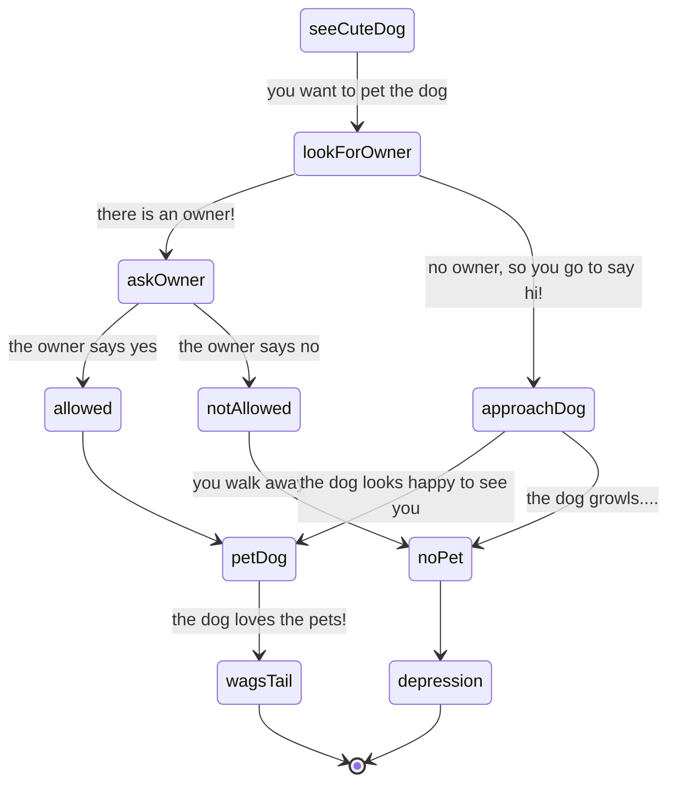

# you see a cute dog when you are walking at the park. if...

## you see the dog has an owner: ask if you can pet it
    if the owner says no, you can't pet the dog and you are sad
    if the owner says yes, you can pet the dog and you are happy
## you see the dog doesn't have an owner: carefully approach the dog
    if the dog is happy to see you, you can pet the dog and you are happy
    if the dog growls at you, you can't pet the dog and you are sad
