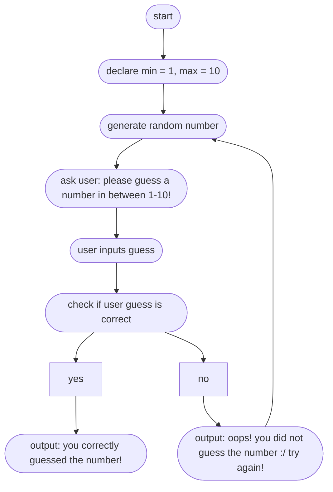

```mermaid
flowchart TD
start([start]) --> declare([declare min = 1, max = 10])
declare --> random([generate random number])
random --> user([ask user: please guess a number in between 1-10!])
user --> input([user inputs guess])
input --> check([check if user guess is correct])
check --> yes
yes --> correct([output: you correctly guessed the number!])
check --> no
no --> retry([output: oops! you did not guess the number :/ try again!])
retry --> random
```
