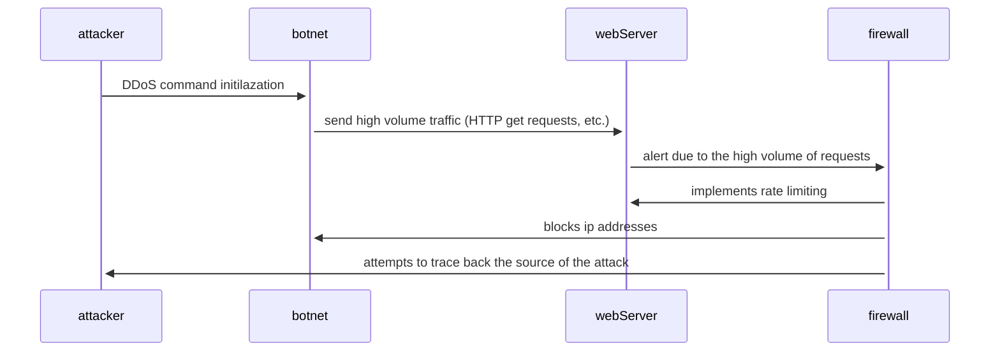

first, the attacker gains access to a large amount of machines, amassing a botnet. then, they send out a command initializing a DDoS attack from the computers in this botnet. the botnet sends a very high volume of traffic such as HTTP get requests to the web server in an attempt to overwhelm it. once the firewall senses this high volume of requests, it alerts. it limits the rate of processing these requests to prevent the system from being completely overwhelmed. it also blocks ip addresses of computers participating in this attack. finally, the firewall can attempt to trace the attack back to the original person who began it.
