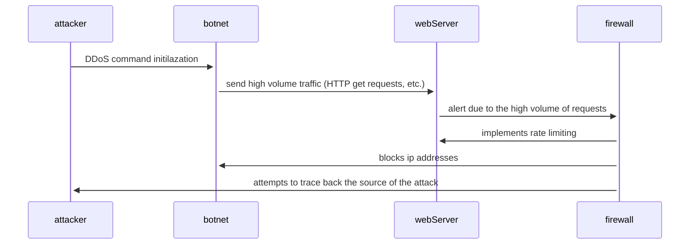

```mermaid
sequenceDiagram
participant attacker
participant botnet
participant webServer
participant firewall
attacker->>+botnet: DDoS command initilazation
botnet->>+webServer: send high volume traffic (HTTP get requests, etc.)
webServer->>+firewall: alert due to the high volume of requests
firewall->>+webServer: implements rate limiting
firewall->>+botnet: blocks ip addresses
firewall->>+attacker: attempts to trace back the source of the attack
```
