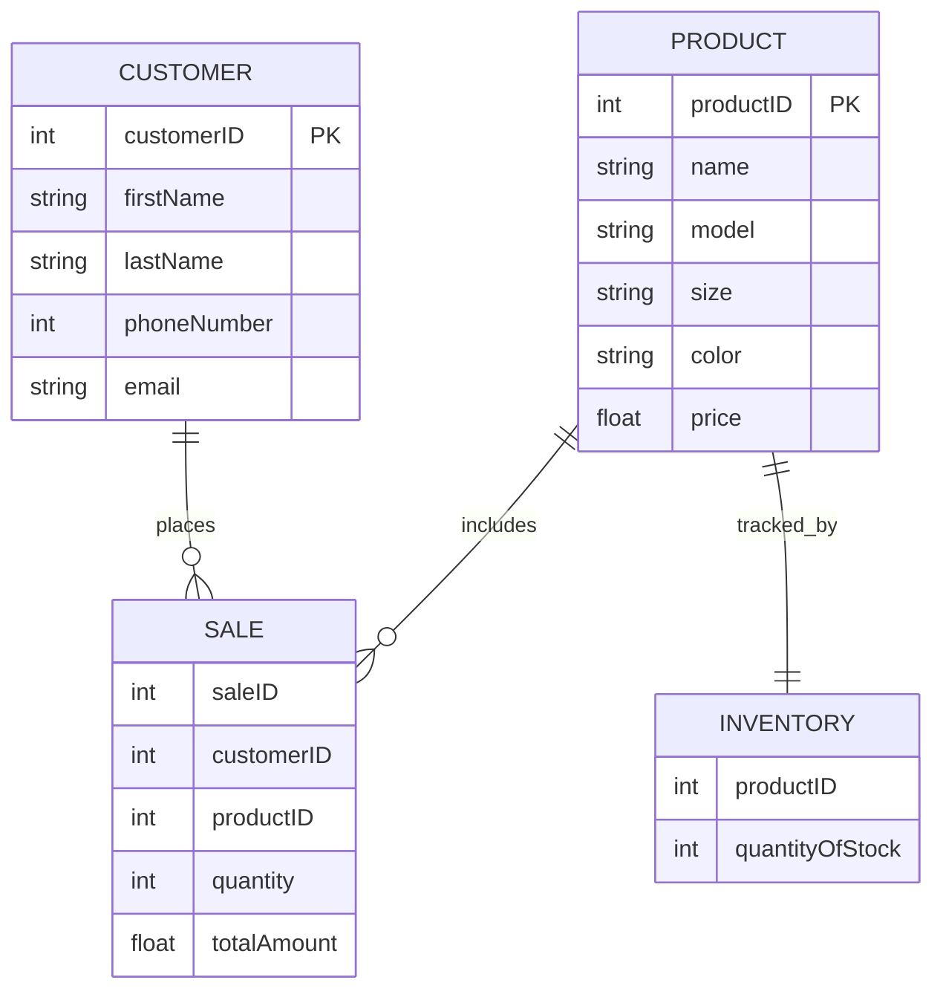

PRODUCT: this contains data for every shoe sold by Nike. every product has a unique numerical product id (productID) and includes info like the shoe model, size, color, and price.

CUSTOMER: this stores the data of anyone making a purchase in the store. each customer has an id (customerID) and their personal details listed.

SALE: this notes the transaction record when a product is purchased. it links the customer id, (customerID), product id (productID), and records the quantity being purchased and the total amount due.

INVENTORY: this tracks the stock available for each product. it uses the product id (productID) to monitor availability of each individual product.
